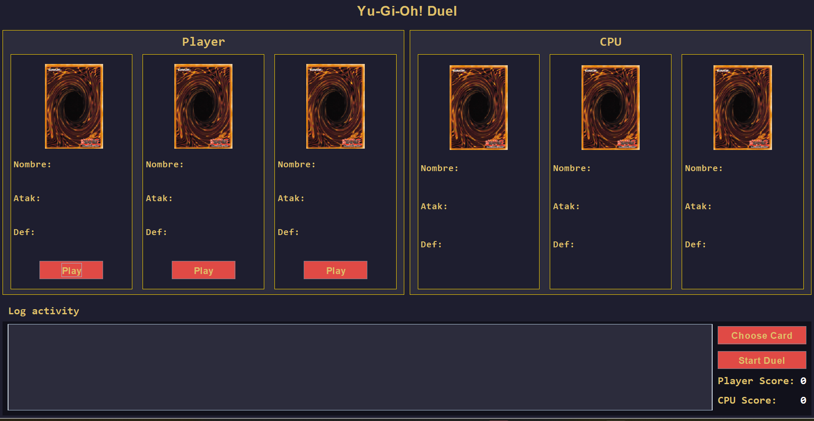
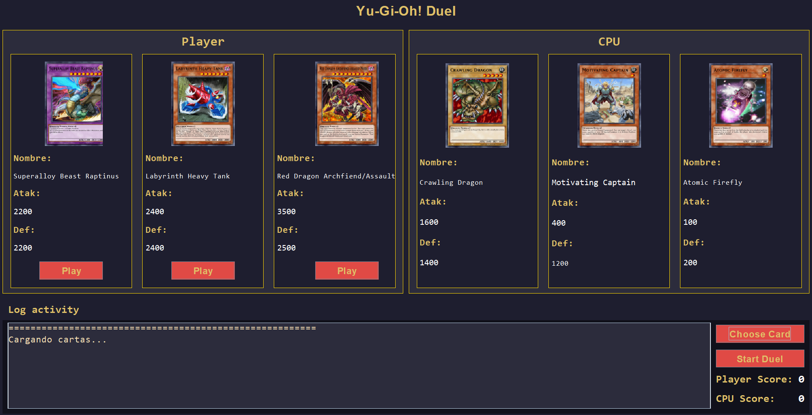
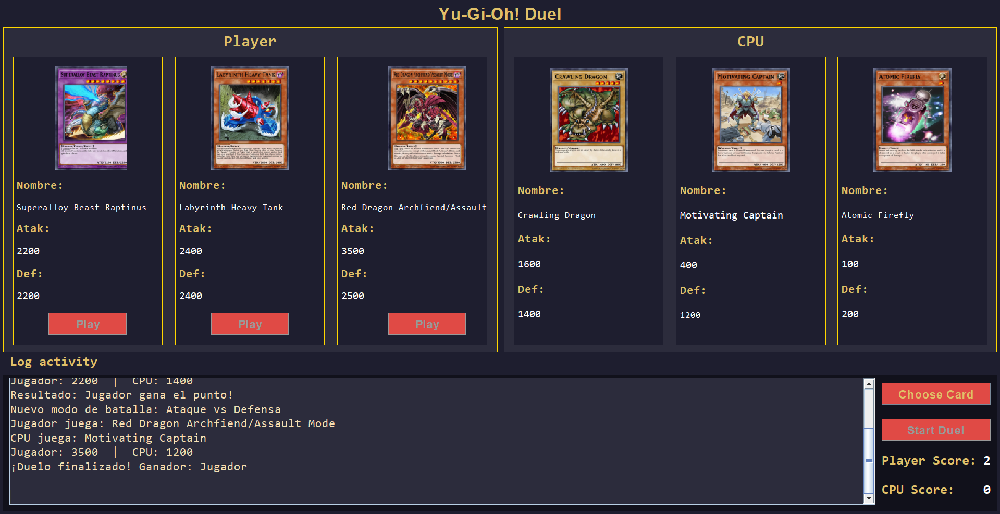
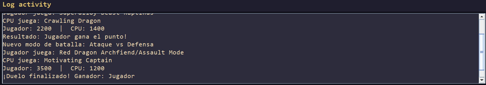

# Yu-Gi-Oh! Duel

**Yu-Gi-Oh! Duel** es una aplicación desarrollada en **Java Swing** que simula duelos entre un jugador y la CPU utilizando cartas reales del universo *Yu-Gi-Oh!*.  
El sistema obtiene cartas de una **API pública** (YGOProDeck API), muestra sus atributos e imágenes, y permite jugar rondas donde cada carta puede usarse en **modo Ataque o Defensa**.

---

## Características principales

- Interfaz gráfica desarrollada con **Java Swing**.
- Obtención de cartas reales desde la **API publica de Yu-Gi-Oh!**.
- Comparación automática entre cartas de **Jugador** y **CPU**.
- Sistema de **puntuación dinámica**.
- Modo de batalla variable (**Ataque / Defensa**) elegido aleatoriamente.
- Registro de eventos en un **Log de batalla desplazable**.
- Manejo de errores de conexión y fallos en la obtención de datos.
- Estilo visual inspirado en la estética clásica de *Yu-Gi-Oh!*.

---

## Tecnologías utilizadas
- **Java**: Lenguaje de programación principal.
- **Java Swing**: Biblioteca para la creación de interfaces gráficas.
- **YGOProDeck API**: Fuente de datos para las cartas de Yu-Gi

---

## Requisitos

- **Java JDK 11** o superior
- **IntelliJ IDEA** (recomendado para el diseño visual con `.form`)
- Conexión a Internet (para obtener las cartas desde la API)
- Biblioteca incluida:
    - `org.json` (para procesar las respuestas de la API)

---

## Diseño del sistema

El proyecto está dividido en capas según su responsabilidad:
- **model** → contiene la clase `Card`, que representa los atributos de una carta.
- **api** → maneja la comunicación con la API de Yu-Gi-Oh! mediante `YuGiOhApiClient`.
- **logic** → implementa las reglas del duelo en la clase `Duel`.
- **listener** → define la interfaz `BattleListener` para comunicar los eventos entre la lógica y la interfaz.
- **GUI** → gestiona toda la interfaz visual (`YuGiOhDuelGUI`), mostrando las cartas, el marcador y el registro de la batalla.

Este diseño promueve una separación clara entre la lógica, la obtención de datos y la interfaz, facilitando la mantenibilidad y comprensión del código.

---

##  Ejecución

1. Clona el repositorio o descarga el proyecto:
   ```bash
   git clone git@github.com:Jaider-Dev/YuGiOhDuel.git
   ```

---

##  Funcionamiento del duelo

- Cada jugador (tú y la CPU) recibe 3 cartas aleatorias.
- Cada carta tiene:
  - Ataque (ATK)
  - Defensa (DEF)
- De manera aleatoria se asigna roles de ataque o defensa.
- El resultado de cada ronda depende del modo asignado:
  - Ataque vs Ataque: gana el mayor ATK.
  - Ataque vs Defensa: gana si ATK > DEF del oponente.
  - Defensa vs Ataque: gana si DEF > ATK del oponente.
- El marcador se actualiza en pantalla.
- El log de batalla registra todas las jugadas.

## Estilo visual

El diseño busca imitar la atmósfera de los duelos clásicos:
- Fondo azul oscuro (#0D0B1A)
- Bordes dorados (#D4AF37)
- Texto amarillo brillante para etiquetas y puntajes
- Botones rojos con texto claro
- Fuente recomendada: Consolas, para mantener una apariencia tipo terminal mágica

## Capturas de pantalla

### Pantalla principal


## Cartas Ejecidas


### Ejemplo de batalla


## Registro de la batalla


## Autor

**Jaider Bermúdez Girón.**

Estudiante de Ingeniería de Sistemas – Universidad del Valle.

**Github:** Jaider-Dev

**✉️ Correo Institucional:** jaider.bermudez@correounivalle.edu.co

**✉️ Correo personal:** jaiderbermudez.contact@gmail.com

## Créditos

- API de cartas: [YGOProDeck API](https://db.ygoprodeck.com/api-guide/)